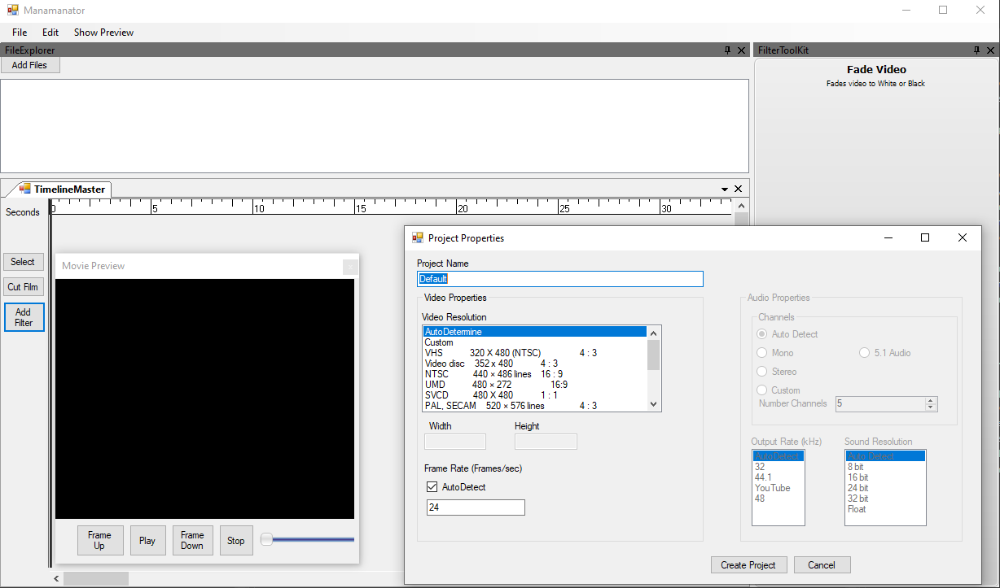
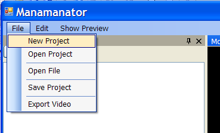
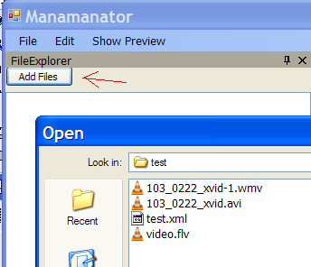
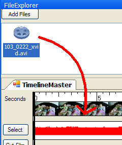
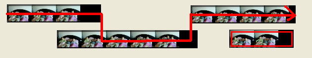

# Manamanator
Nonlinear video editor with easy filter creation


## Project Status

This project has been abandoned and is maintained here solely for educational and historical interest. It was originally written for Windows Vista and has not been updated since.



## Compilation Instructions

To compile this project, the following dependencies are required:

- **Tao.OpenAL**: A .NET binding for OpenAL.
- **OpenALDotNet**: Available at [SourceForge](https://sourceforge.net/projects/cs-openal/).
- **VistaMenuControl**: Available at [WyDay](https://wyday.com/vistamenu/).
- **Weifen Luo's Docking Controls**: A library for creating dockable windows in .NET applications.

Make sure to download and install these dependencies before attempting to compile the project.

# Mananator QuickStart

## Getting Started

The program is mostly just a framework at this point, but it still can be used to edit movies. The cut, copy, move, and encode functions work well. If you wish to import more movie formats (mov, flv, etc.), you should download and install [ffdshow](https://sourceforge.net/project/downloading.php?group_id=53761&filename=ffdshow-20020617.exe&a=10479968).

The name is a little odd: It refers to "Mana Mana" from the Muppets. I originally built this video editor to help me play with my daughters who wanted to make their own Mana Mana video. The name is the Mana Mana Editor -> Manamanator. I will probably change the name sometime, but not today.

## To edit a movie

### 1. Create a new project



Enter all the needed data into the next page. Most of the data will be automatically sensed, but your desired framerate and framesize are important to the editing process.

### 2. Import Media files



Load all the media files that you desire into the project. It is wise to save your project at this point. The program can handle any media format that has a registered codec on the system, or that ffdshow supports if you are using ffdshow.

### 3. Drag Files to timeline editor



Drag the desired file from the project file explorer to the timeline editor. Here you can cut, copy, move, and arrange the media as desired. When you have everything set up as desired, press play on the viewer to begin.

You should remember that the Manamanator always selects the clip that is highest in the timeline editor to pull frames.



This image shows the way that the clips will be played. A similar path will be followed for the audio effects.

### 4. Export finished video

When the video plays like you wish in the viewer, you can export the finished video. This is done by clicking File and then Export Video. Select the output folder and filename, select the output format, and click export.
```